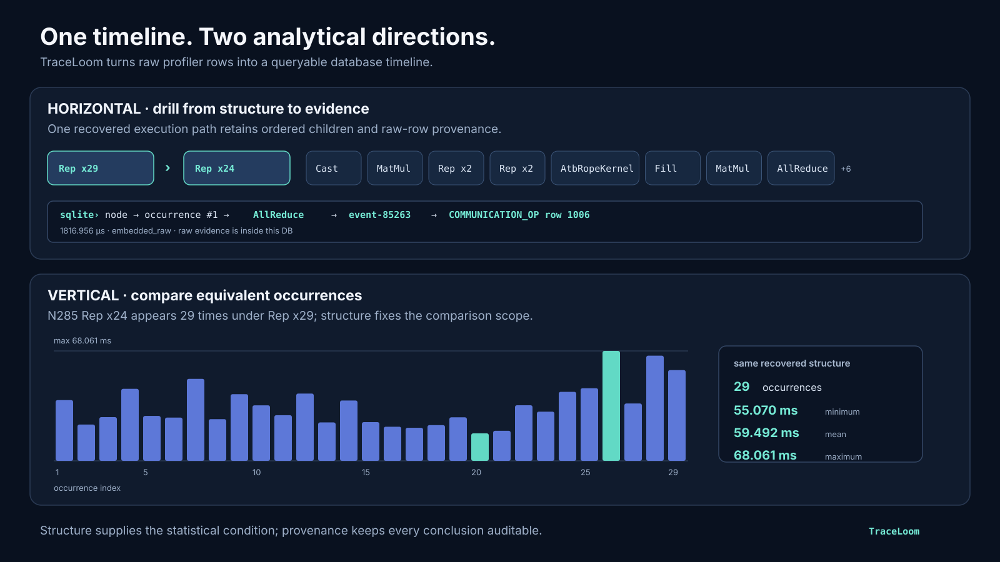

# TraceLoom

[中文说明](README.zh.md)


[](native/)
[](LICENSE)

TraceLoom is a native C++17 offline analyzer for accelerator profiler traces.
It turns raw profiler databases into a self-contained **queryable database timeline**: a coarse-to-fine execution structure, cost distributions, exact
replay internals where evidence permits, and links back to embedded raw rows.



The hierarchy supports two complementary analysis directions. Drill
**horizontally** from a structural node through one occurrence and normalized
event to its embedded raw profiler row. Compare **vertically** across every
equivalent occurrence of the same recovered structure. The structure defines
the statistical scope; provenance keeps the result auditable.

Try the reproducible, beginner-friendly
[`60-second database-timeline tour`](examples/db-timeline-tour) on the checked-in real
profile—no prior SQL experience is required.

The native implementation is now the only production implementation in this
repository. The installed CLI has one stable name:

```bash
traceloom <profile.db-or-profile-dir>
```

## What TraceLoom Does

```text
profiler SQLite
  -> event normalization and source provenance
  -> semantic anchor extraction
  -> repeated-pattern discovery
  -> overlap-safe timeline cost attribution
  -> queryable database timeline
```

Key capabilities:

- Ascend/CANN monolithic and split-SQLite profile discovery, with automatic
  fallback when a usable monolithic `TASK` table is unavailable;
- CUDA/Nsight kernel, runtime, data-movement, synchronization, event, and graph
  replay ingestion through the native adapter;
- native semantic reconstruction for compute, HCCL, synchronization, and
  ACLGraph activity;
- repeated decode/layer structure discovery over semantic anchors;
- overlap-safe wall-clock accounting across concurrent streams;
- repeat-node averages normalized per loop-body iteration;
- provider-aware runtime-call ↔ device-work relations with explicit
  cardinality and open/ambiguous outcomes;
- reverse navigation from device anchors and auxiliary work to host runtime
  calls, including observed host runtime activity between adjacent anchors;
- provenance links back to the original database, table, and row.

CUDA auxiliary activity stays explicitly typed and traceable without being
misreported as compute. CUDA graph traces are represented as replay intervals
and share the native Loop Tree report surface with eager CUDA and Ascend input.

## Install On Debian Or Ubuntu

Build the `traceloom-native` Debian package from the repository root:

```bash
cmake -S native -B build/traceloom-native-package \
  -DCMAKE_BUILD_TYPE=Release \
  -DTRACELOOM_NATIVE_BUILD_TESTS=OFF
cmake --build build/traceloom-native-package -j "$(nproc)"
cpack --config build/traceloom-native-package/CPackConfig.cmake \
  -B build/traceloom-native-package
sudo apt install ./build/traceloom-native-package/traceloom-native_*.deb
```

The package installs only `/usr/bin/traceloom`. Verify it with:

```bash
traceloom --version
traceloom --help
```

Runtime package dependencies are `libc6`, `libstdc++6`, and `libsqlite3-0`.

To uninstall:

```bash
sudo apt remove traceloom-native
```

## Install From Source

```bash
cmake --preset dev
cmake --build --preset dev -j "$(nproc)"
cmake --install build/native --prefix "$HOME/.local"
```

Make sure `$HOME/.local/bin` is in `PATH`, then run `traceloom --version`.

## Quick Tutorial

### 1. Analyze One Database

```bash
traceloom /path/to/PROF_.../msprof_YYYYMMDDHHMMSS.db
```

The default product is a self-contained queryable database timeline written beside the source database:

```text
/path/to/PROF_.../traceloom/analysis.db
```

### 2. Analyze A Profiler Directory

```bash
traceloom /path/to/msprof_output
```

TraceLoom discovers monolithic `PROF_*/msprof_*.db` files and split
`PROF_*/{host,device_*}/sqlite/*.db` layouts, then writes one self-contained
database per discovered analysis input:

```text
/path/to/msprof_output/traceloom/analysis_db01.db
/path/to/msprof_output/traceloom/analysis_db02.db
```

Use an explicit worker count for large traces:

```bash
traceloom /path/to/msprof_output --threads 48
```

Within each `PROF_*`, a nonempty monolithic `TASK` table takes priority.
Otherwise TraceLoom emits a warning and builds the base timeline from split
`AscendTask`, `TaskInfo`, `HostTask`, and `ApiData` tables. When present,
`HCCLOP`/`HCCLOpSingleDevice` and `HCCLTaskSingleDevice` recover the same
collective-operation anchors as the monolithic path while retaining the
device-task decomposition as auxiliary evidence. Graph replay uses the same
exact reconstruction contract in both layouts; PMU attribution remains
incremental.

For a split `PROF_*` layout, all constituent SQLite files are copied into one
portable artifact under collision-free names. For a regular profiler DB, its
raw schema is snapshotted intact.

### 3. Read The Database Timeline

Each database describes its stable entry points:

```bash
sqlite3 /path/to/traceloom/analysis.db \
  'SELECT surface_name, relation_name, purpose FROM traceloom_analysis_surface;'
sqlite3 -header -column /path/to/traceloom/analysis.db \
  'SELECT local_node_id, label, depth, occurrence_count, avg_total_us FROM traceloom_v_tree_node ORDER BY display_order;'
```

Start at outer Repeat nodes, then drill through node occurrences, anchors,
normalized events, exact graph members, and raw evidence. Important costs are:

- `total_us`: disjoint wall-clock union; overlapping streams are not counted
  twice;
- `avg_total_us`: per occurrence for ordinary nodes and per loop-body
  iteration for Repeat nodes;
- `avg_compute_us`, `avg_comm_us`, `avg_idle_us`: comparable average cost
  categories;
- `avg_aux_us` and `avg_self_us`: attributed auxiliary and node-owned cost.

To inspect profiler-observed host runtime behavior corresponding to device
structure (without assigning an idle cause):

```sql
SELECT anchor_idx, anchor_symbol, api_name, support_state, cardinality
FROM traceloom_v_anchor_runtime_call
ORDER BY device_id, anchor_idx, runtime_start_ns;

SELECT api_name, count(*) AS occurrences,
       round(sum(observed_dur_us), 3) AS observed_runtime_us
FROM traceloom_v_anchor_host_activity
GROUP BY api_name
ORDER BY observed_runtime_us DESC
LIMIT 30;
```

For the complete horizontal-and-vertical experience shown above:

```bash
sqlite3 -readonly \
  examples/kickstart_smoke/msprof_raw/traceloom/analysis_db01.db
```

Then run this at the `sqlite>` prompt:

```sql
.read examples/db-timeline-tour/tour.sql
```

### 4. Choose An Explicit Output Path

`--output` changes the first-class database path; `--aug-db-out` remains a
compatibility spelling:

```bash
traceloom /path/to/msprof.db --output /tmp/run.traceloom.db
```

The input is opened read-only. TraceLoom snapshots every raw profiler table
into the new file and appends its `traceloom_*` hierarchy, occurrence, exact
graph, replay-cost, provenance, and typed-issue relations. The resulting file
can be moved away from the input and queried without `ATTACH`:

```bash
sqlite3 /tmp/run.traceloom.db < docs/report-sql/replay-cost-hotspots.sql
sqlite3 /tmp/run.traceloom.db < docs/report-sql/node-replay-cost-members.sql
```

Use `source_table` and `source_row_id` to audit a selected member directly in
the copied vendor table. `traceloom_metadata` records the original path,
byte-size, and SHA-256 as provenance; they are not runtime dependencies.

For split layouts, inspect `traceloom_raw_source_database` and
`traceloom_raw_table` to resolve each original `(source_path, source_table)` to
its embedded table and preserved source-rowid column.

### 5. Request Other Advanced Evidence

Markdown and native JSON are explicit projections/debug products, not a second
analytical model:

```bash
traceloom /path/to/msprof.db \
  --loop-tree-out /tmp/loop_tree_v2.md \
  --output /tmp/traceloom-analysis.db \
  --out /tmp/native_result.json
```

Run `traceloom --help-advanced` for grammar diagnostics and auxiliary
materialization options.

Ascend Loop Trees include an observation-backed device summary of visible
productive gaps. It preserves unattributed residual and states its collection
status explicitly; it must not be read as hardware-idle or causal evidence.

## Checked-In Kickstart Profile

The repository includes a real two-device vLLM-Ascend profile under
[`examples/kickstart_smoke`](examples/kickstart_smoke). Try it with:

```bash
traceloom examples/kickstart_smoke/msprof_raw
```

The capture contains more than 1.18 million selected profiler rows. TraceLoom
compresses them into 112 structural nodes and recovers the same nested
`Repeat x36 -> Repeat x24` transformer pattern on both devices.

## Development

```bash
cmake --preset dev-tests
cmake --build --preset dev-tests -j "$(nproc)"
ctest --preset dev-tests
```

Some deep regression tests use external research fixtures. Standalone clones
skip those tests when the fixture directory is absent; normal native unit tests
still run.

## Documentation

- [Native analyzer and packaging guide](native/README.md)
- [Step-by-step workflow](docs/workflow.md)
- [Accepted input layouts](docs/input-profiles.md)
- [Output contract](docs/output-schema.md)
- [Native architecture](docs/architecture.md)
- [Queryable database timeline guide (Chinese)](docs/db-timeline-guide.zh.md)

## License

TraceLoom is released under the [MIT License](LICENSE).
